# Compliance Engine v7.0.0

A scalable, production-ready compliance engine for cross-border data transfer evaluation. It sits upon a graph-native architecture backed by FalkorDB, utilizes a React/TypeScript frontend (Vite), and harnesses AI-powered multi-agent flows orchestrated by LangGraph and the Google A2A SDK.

---

## 1. Architecture Overview

```
compliance_engine/
├── api/                        # FastAPI application containing business logic routers
│   ├── main.py                 # Application bootstrapper, CORS, Router Registrations
│   ├── dependencies/           # Shared dependencies (e.g., auth.py for JWT)
│   ├── services/               # Modular business logic (e.g., ldap_auth.py)
│   └── routers/                # Sub-divided API endpoints for modularity
├── agents/                     # LangGraph AI workflows & Multi-Agent implementations
├── config/                     # Pydantic v2 Environment configurations (settings.py)
├── models/                     # Pydantic schemas enforcing IO boundaries
├── rules/                      # Graph Data Dictionaries and templates
├── services/                   # Graph execution services (RulesEvaluator, Cache, Backup)
├── utils/                      # Ingestion utilities (GraphBuilder, DataUploader)
└── frontend/                   # React 19 + TypeScript SPA
```

### Core Design Principles
1. **Graph-Native Centralization**: After executing `--build-graph`, the application relies purely on FalkorDB. Runtime JSON/CSV parsing is strictly avoided to maximize I/O performance.
2. **Stateless Scalability**: The backend is stateless. User sessions rely on JWT, and AI generation sessions rely on persistent file backends/distributed stores.
3. **Comprehensive Rule Processing**: Evaluation never short-circuits. All matching graph rules fire aggregating prohibitions, permissions, and duties together. 

---

## 2. Authentication & Role-Based Access Control (RBAC)

The application enforces a rigid security model separating standard users from application administrators. It uses a **Hybrid Token Architecture** marrying Active Directory (LDAP) credential verification with robust stateless JSON Web Tokens.

### 2.1 Backend Implementation Details
- **LDAP Binding (`api/services/ldap_auth.py`)**: When `ENABLE_LDAP` is true in `.env`, the `/login` endpoint takes the provided credentials and attempts an anonymous/bound bind using the `ldap3` library to an Enterprise Active Directory. 
- **LDAP Injection Protection**: To prevent directory traversal, input usernames are strictly stripped and checked via regex (`^[a-zA-Z0-9_\-\.\@]+$`) before injection into the LDAP query.
- **JWT Minting (`api/dependencies/auth.py`)**: Upon successful credential verification (either LDAP or the configured bcrypt local fallback `admin`), `python-jose` generates an HMAC-SHA256 encrypted JWT string. The payload encodes the `sub` (username) and `role` (`admin` or `user`), alongside an expiry timestamp (`exp`).
- **FastAPI Dependency Injection**: 
  - `get_current_user`: Decodes the bearer token. Used on External APIs to ensure base-level access.
  - `get_current_admin`: Wraps `get_current_user` and actively aborts the request with a `403 Forbidden` if the sub-role isn't `admin`. This guards graph structural rebuilding, sandbox states, and taxonomies from unauthorized manipulation.

### 2.2 Frontend Implementation Details
- **Store Abstraction (`authStore.ts`)**: `Zustand` completely manages the frontend authentication lifecycle. Invoking `login()` dispatches an asynchronous `application/x-www-form-urlencoded` post to `api/auth/login`. Upon resolution, the JWT token and `Role` are synchronized down to reactive components and `localStorage` for session persistence.
- **Route Guards (`ProtectedRoute.tsx`)**: The React Router architecture intercepts DOM painting. `/saved-policies` and `/dashboard` are hidden beneath an `<ProtectedRoute requiredRole="admin">` component. If a generic `user` attempts navigation via URL injection, the router ejects them instantly, preventing unauthorized bundle loading.
- **Axios Interception (`api.ts`)**: An `axios.interceptor.request` listener listens for any outbound HTTP fetch. It grabs the JWT from Zustand to automatically inject an `Authorization: Bearer <token>` header out of band. A corresponding `response` interceptor listens for `HTTP 401 Unauthorized` headers to cleanly trigger auto-logouts globally across the app.

---

## 3. Policy Evaluator Logic

The core value proposition of the system rests within `services/rules_evaluator.py`, executing multi-dimensional Cypher matrices against a connected schema.

### 3.1 Graph Connectivity Rule Set
Instead of iterating through nested loops, data is matched dynamically in the Graph. Rules link to Graph Entities mapping to three functional layers:
- **SET 1 (Case-Matching)**: Directly searches topological bounds over Historical Data Transfers.
- **SET 2A (Transfer Bounds)**: Applies specific restrictions routing data Origin -> Receivers geographically. 
- **SET 2B (Attribute Logic)**: Applies restrictions specifically regarding Data Nature (Biometric, Financial, Health, PII).

### 3.2 Matrix Evaluation Engine
1. **Query Dispatch**: When `/evaluate-rules` is invoked, the JSON parameter list (Taxonomy Nodes, Target Countries, Purposes) is flattened into a dictionary. 
2. **Pathing Algorithm**: The engine invokes `MATCH` statements through FalkorDB searching for traversing edges (`TRIGGERED_BY`, `RECEIVED_IN`, `ORIGINATES_FROM`, `HAS_PERMISSION`, `CAN_HAVE_DUTY`). 
3. **No Short-Circuiting**: Compliance is aggregated, not binary. The system intentionally pulls *all* intersecting nodes. If 12 rules trigger, all 12 are parsed.
4. **Boolean Reducer**: 
   - Rule outcome vectors are unioned.
   - Distinct associated Duties (e.g., Transfer Impact Assessments, SCC signoffs) are appended to a Set.
   - If *any* node inside the traversed path maps to a `Prohibition` edge, a hard failover occurs, overriding permissions, effectively locking the Transfer Matrix to a **PROHIBITED** state.

---

## 4. Dashboard & Taxonomy Data Management

Access to the Dashboard is heavily guarded by the `admin` RBAC role. The UI enables structural mutation over the underlaying graph definitions.

### 4.1 Legal Entity & Taxonomy Mapping Matrix
A cornerstone logic correction implemented in this version mapped the system from a `1 Legal Entity -> N Countries` schema to the accurate `1 Country -> N Legal Entities` real-world mapping schema.
- Operations from the frontend use React dropdowns. Selecting "Target Country" dispatches an update over the backend endpoint locking the parameters. 
- The backend mutates Cypher relationships via `MATCH (c:Country {iso2: $country}) MERGE (l:LegalEntity {name: $entity}) MERGE (c)-[:HAS_LEGAL_ENTITY]->(l)`.

### 4.2 Dynamic Dictionary Upload Pipeline
Because taxonomies frequently shift dynamically, the Dashboard provides native utilities for live ingestion:
- **Template Generation (`GET /api/admin/dictionaries/{type}/template`)**: Administrators can click to download blank templates mapped to internal database schemas. The backend routes the Dictionary Type directly into `pandas.DataFrame()`, mapping columns conditionally (e.g., `['Name', 'Definition', 'GDPR Category Name']`), returning it to the browser as a synthesized `text/csv` stream.
- **Native Parsing & Ingestion**: Administrator CSV uploads hit `/api/admin/upload-dictionary`. The binary streams are temporarily stored, loaded into dataframe validation tools dropping `NaN`s, and chunked into memory. A loop dynamically injects them into the Graph engine invoking `RulesGraphBuilder` indexing nodes directly without requiring a system reboot.

---

## 5. Agentic AI Policy Generator Wizard (6 Steps)

Underpinning the policy creation UI is a Long-Running, Stateful, SSE-streamed Agentic architecture utilizing the LangGraph framework.

1. **Step 1: Input**: User uploads raw regulatory text. 
2. **Step 2: AI Orchestration (SSE Stream)**: Backend receives input and spawns an `asyncio.create_task()`. It delegates processing to the `LangGraph` topology interacting with `o3-mini`. The UI consumes Server Sent Events mapping `agent_events.py` state ticks to load bars.
3. **Step 3: Graph Linkage**: The compiled AI output uses Named Entity Recognition (NER) models to heuristically guess what Taxonomy nodes (Countries, Sensitivities) are mentioned, querying the Graph dynamically.
4. **Step 4: Manual Admin Review**: Human in the loop review.
5. **Step 5: Sandbox Topology**: Before destroying live databases, the app creates a `TempGraph_{UUID}` schema namespace. It dumps the theoretical edge mapping into this Temporary Graph and executes the Evaluator engine against synthetic transfers, assuring it functions properly.
6. **Step 6: Promotion**: Approving deletes the Temporary Sandbox Graph and promotes the new rules directly natively to the permanent `RulesGraph`.

---

## 6. Comprehensive API Reference Documentation

All endpoints listen on port `5001`. Interactive schemas can be found at `http://localhost:5001/docs`.

### 6.1 Authentication (Base)
| Method | Endpoint | Access Role | Description |
|--------|----------|-------------|-------------|
| `POST` | `/api/auth/login` | Public | Accepts `username` and `password` payload. Verifies against LDAP or local dictionary. Returns JSON Web Token (Bearer). |

### 6.2 External APIs (User Role Required)
| Method | Endpoint | Access Role | Description |
|--------|----------|-------------|-------------|
| `POST` | `/api/evaluate-rules` | User+ | Primary Matrix Evaluator. Sends cross-border transaction vectors and returns the outcome (`ALLOWED`/`PROHIBITED`) with required duties. |
| `POST` | `/api/search-cases` | User+ | Queries historical transfers spanning the DataTransferGraph filtering over constraints. |
| `GET` | `/api/rules-overview` | User+ | Returns pagination over the raw JSON rule objects in the node structure. |
| `GET` | `.../rules-overview-table` | User+ | Returns the same structure formatted heavily optimized for Data-table ingestion, including linked edges recursively processed. |
| `GET` | `/api/countries` | User+ | Fetches all valid ISO nodes for frontend dropdown population. |
| `GET` | `/api/all-dropdown-values` | User+ | A massive aggregation query returning lists arrays targeting Purposes, Authorities, Regulators, and GDCs. Used by `<Select>` React components. |
| `GET` | `/api/legal-entities` | User+ | Iterates nodes returning dictionaries mapping `Country -> [LegalEntities]`. |

### 6.3 Internal Admin APIs (Admin Role Required)
*Warning: Accessing these endpoints using a `user` JWT throws a `403 Forbidden` error.*

| Method | Endpoint | Access Role | Description |
|--------|----------|-------------|-------------|
| `GET` | `/api/admin/rules` | Admin | Dumps full unminified rules JSON definitions directly. |
| `POST` | `/api/admin/upload-dictionary`| Admin | Accepts `multipart/form-data` CSV payload and parses them into internal database structures conditionally by matching the taxonomy dropdown choice. |
| `GET` | `/api/admin/dictionaries/{id}/template`| Admin | Returns an instant pandas-constructed binary `.csv` formatted structural layout template. |
| `POST` | `/api/admin/rebuild-graph` | Admin | Potentially destructive. Strips the current database arrays and parses from local static folder mapping arrays if out of sync. |
| `GET` | `/api/graph/rules-network` | Admin | Cypher visualization extraction mapping specific subgraphs recursively. |
| `POST` | `/api/wizard/start-session` | Admin | Bootstraps a local stateful `UUID` returning session dict mapping. |
| `POST` | `.../wizard/submit-step` | Admin | Executes steps synchronously or asynchronously firing LangGraph logic via an AI Thread spawn. |
| `POST` | `.../wizard/session/{id}/load-sandbox`| Admin | Copies rules dynamically into a sandboxed test node matrix inside FalkorDB. |
| `POST` | `.../wizard/session/{id}/approve`| Admin | Commits the Sandbox into prod. |
| `POST` | `/api/rules/{id}/link-regulator`| Admin | Binds a `LINKED_TO` relationship natively connecting the Rule ID mapping to a specific Authority Node array logic block. |
| `GET` | `/api/jobs/{id}/stream` | Admin | Establishes a raw HTTP Event Stream proxy returning textual SSE updates directly from background `asyncio` task states. |

---

## 7. Graph Schema & Topology (FalkorDB)

The core compliance engine architecture abandons RDBMS and document stores in favor of a natively connected graph. This provides extreme agility in mapping disparate privacy laws globally without joining thousands of sub-tables.

The schema mapped below represents the exact structure currently loaded into `RulesGraph` based on the live dynamic extraction topology.

### 7.1 Entity Relationship Architecture

```mermaid
erDiagram
    %% Core Entities
    COUNTRY {
        string name
        string iso2
        string iso3
        string rtn_code
    }
    COUNTRY_GROUP {
        string name
    }
    LEGAL_ENTITY {
        string name
    }
    GLOBAL_BUSINESS_FUNCTION {
        string name
        string rtn_code
        string gbgf_level_1
        string gbgf_level_2
        string privacy_notice
    }
    
    %% Regulatory Entities
    AUTHORITY {
        string name
        string country_code
    }
    REGULATOR {
        string name
        string country_code
        string region
        string regulator_type
        boolean notification_m
        boolean approval_m
    }

    %% Data Processing Entities
    PROCESS {
        string name
        string definition
        string level_1_name
        string level_2_name
        string category
    }
    DATA_CATEGORY {
        string name
        string definition
        string gdpr_category_name
    }
    SENSITIVE_DATA_CATEGORY {
        string name
        string country_code
        string definition
    }
    PURPOSE_OF_PROCESSING {
        string name
        string description
    }
    
    %% Policy Matrix (Rules)
    RULE {
        string rule_id
        string name
        string description
        int priority
        string outcome
        string odrl_type
        boolean requires_personal_data
        boolean has_pii_required
    }
    PERMISSION {
        string name
    }
    PROHIBITION {
        string name
    }
    DUTY {
        string name
        string module
        string value
    }
    ACTION {
        string name
    }
    ATTRIBUTE {
        string name
    }

    %% Top-Level Links
    COUNTRY ||--o{ COUNTRY_GROUP : "BELONGS_TO"
    COUNTRY ||--o{ LEGAL_ENTITY : "HAS_LEGAL_ENTITY"
    COUNTRY ||--o{ REGULATOR : "HAS_REGULATOR"
    COUNTRY ||--o{ AUTHORITY : "HAS_AUTHORITY"
    COUNTRY ||--o{ GLOBAL_BUSINESS_FUNCTION : "HAS_GBGF"
    COUNTRY ||--o{ SENSITIVE_DATA_CATEGORY : "HAS_SENSITIVE_DATA_CATEGORY"
    
    PROCESS ||--o{ GLOBAL_BUSINESS_FUNCTION : "BELONGS_TO_GBGF"
    PROCESS ||--o{ PROCESS : "HAS_SUBPROCESS"
    
    %% Policy Triggers
    RULE }o--o{ COUNTRY : "TRIGGERED_BY_ORIGIN (Matrix Bound)"
    RULE }o--o{ COUNTRY : "TRIGGERED_BY_RECEIVING (Matrix Bound)"
    RULE }o--o{ COUNTRY : "ORIGINATES_FROM (Transfer Bound)"
    RULE }o--o{ COUNTRY : "RECEIVED_IN (Transfer Bound)"
    
    %% Policy Outcomes
    RULE ||--o| PERMISSION : "HAS_PERMISSION"
    RULE ||--o| PROHIBITION : "HAS_PROHIBITION"
    RULE ||--o{ ACTION : "HAS_ACTION"
    RULE ||--o{ DATA_CATEGORY : "HAS_DATA_CATEGORY"
    RULE ||--o{ ATTRIBUTE : "HAS_ATTRIBUTE"
    
    %% Sub-Outcomes
    PERMISSION ||--o{ DUTY : "CAN_HAVE_DUTY"
    
    %% External Dynamic Links
    RULE }o--o{ REGULATOR : "LINKED_TO (Dynamic Constraint)"
    RULE }o--o{ AUTHORITY : "LINKED_TO  (Dynamic Constraint)"
    RULE }o--o{ PURPOSE_OF_PROCESSING : "LINKED_TO (Dynamic Constraint)"
    RULE }o--o{ LEGAL_ENTITY : "LINKED_TO (Dynamic Constraint)"
    RULE }o--o{ PROCESS : "LINKED_TO (Dynamic Constraint)"
```



### 7.2 Strict Node Attributes

Extracted directly via live graph introspection query scripts: `schema_extract.py`.

| Node Label | Core Properties (Extracted dynamically) |
|------------|-----------------------------------------|
| **Rule** | `rule_id`, `name`, `description`, `priority`, `outcome`, `rule_type`, `enabled`, `odrl_type`, `odrl_action`, `odrl_target`, `has_pii_required`, `requires_any_data`, `requires_personal_data`, `logic_tree`, `origin_match_type`, `receiving_match_type` |
| **Country** | `name`, `iso2`, `iso3`, `rtn_code` |
| **LegalEntity** | `name` |
| **Regulator** | `name`, `country_code`, `region`, `regulator`, `regulator_type`, `regulator_definition`, `notification_m`, `approval_m`, `automated_notification` |
| **Authority** | `name`, `country_code` |
| **Action** | `name` |
| **Permission** | `name` |
| **Prohibition** | `name` |
| **Duty** | `name`, `module`, `value` |
| **Process** | `name`, `definition`, `global_business_function`, `process_level_indicator`, `level_1_name`, `level_2_name`, `level_3_name`, `category`, `l1`, `l2`, `l3` |
| **GlobalBusinessFunction** | `name`, `rtn_code`, `gbgf_level_1`, `privacy_notice`, `gbgf_level_2` |
| **GDC** | `name`, `definition`, `data_domain`, `data_privacy_indicator`, `gdc_level_2`, `gdc_level_3`, `category` |
| **DataCategory** | `name`, `definition`, `gdpr_category_name` |
| **SensitiveDataCategory** | `name`, `country_code`, `definition`, `sensitive_data_category_name` |
| **DataSubject** | `name`, `definition` |

### 7.3 DataTransferGraph
(This graph represents the historical cases sandbox and evaluation transaction instances).

**Nodes:** `Case`, `Country`, `Jurisdiction`, `Purpose`, `ProcessL1/L2/L3`, `PersonalData`, `PersonalDataCategory`
**Key topological relationships:** `ORIGINATES_FROM`, `TRANSFERS_TO`, `HAS_PURPOSE`, `HAS_PROCESS_L1/L2/L3`
